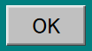
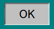

# LT構成案

## タイトル案

**ReactでVBフォームを再発明する**


---

# 1. 導入：最近のフロントエンド、見た目のインパクトがない

```text
React、Tailwind、shadcn/ui、Radix、Headless UI……
便利だけど、見た目はだいたい今っぽくなる。

でも、ふと思ったんです。

「昔の業務アプリっぽいUI、ReactとTailwindで作ればいいんじゃないか？」
```


```text
今日は、これを捨てます。
目指すのは、Windows 95 / Visual Basic の Form1 です。
```

---

# 2. ゴール：作りたいもの

これが完成イメージです。


```tsx
<VBWindow title="社員ﾏｽﾀﾒﾝﾃ" status={status}>
  <VBForm onSubmit={handleSubmit}>
    <VBFrame title="【社員情報】">
      <VBTextBox label="ﾒｰﾙｱﾄﾞﾚｽ：" type="email" value={employee.email} />
      <div className="grid grid-cols-2 gap-4 max-[560px]:grid-cols-1 max-[560px]:gap-3">
        <VBTextBox label="姓：" value={employee.lastName} />
        <VBTextBox label="名：" value={employee.firstName} />
      </div>
    </VBFrame>

    <div className="mt-3 flex justify-end gap-2">
      <VBButton type="submit">登録</VBButton>
      <VBButton type="button">ｸﾘｱ</VBButton>
    </div>
  </VBForm>
</VBWindow>
```

ここで言いたいことは、

```text
やっていることは普通のReactコンポーネント。
でも見た目は完全にレガシー。
```


---

# 3. Windows 95 / VBっぽさの正体


```text
・背景は #c0c0c0
・角丸なし
・フォントは 14px
・「ｶﾀｶﾅ」は半角
・余白は狭い
・ボタンは左上が明るく、右下が暗い
・クリックするとへこむ
・入力欄は逆に沈んでいる
・タイトルバーは濃い青
・全部ちょっと窮屈
```


```text
「古いUIっぽさ」は、雰囲気ではなくCSSで分解できる
```

---

# 4. Tailwindで立体ボタンを作る

```tsx
<button
  className="
    border py-0.5 px-4 bg-[#c0c0c0]
    border-l-white border-t-white
    border-r-[#404040] border-b-[#404040]
    shadow-[inset_-1px_-1px_0_#808080,inset_1px_1px_0_#dfdfdf]
  "
>
  OK
</button>
```

```text
枠あり 上下左右にパディング(横が広い) 背景色は灰色(コントロール色)
左上枠を白くする
右下枠を黒くする
枠の内側にうっすらと影をつけてぼやかす


```
「押せそう」なボタンの出来上がり

そして、クリック中は「凹んだ」感じにします

```tsx
active:border-t-[#404040] active:border-l-[#404040]
active:border-r-white active:border-b-white
active:shadow-[inset_1px_1px_0_#808080]
active:translate-x-[1px] active:translate-y-[1px]
```




```text
左上枠を黒くくする
右下枠を白くする
枠の内側にうっすらと影をつけてぼやかす
translateで右下へ1px移動して動きをつける
```

---

# 5. TextBoxは「沈ませる」

ボタンと逆に、入力欄は沈んでいるように見せます。

```tsx
<input
  className="
    border py-0 px-0.5 bg-white
    outline-none
    border-t-[#404040] border-l-[#404040]
    border-r-white border-b-white
    shadow-[inset_1px_1px_0_#808080,inset_-1px_-1px_0_#dfdfdf]
  "
/>
```


```text
枠あり 上下左右パディングを小さく 背景色は白
フォーカス時の枠を消す
左上枠を黒くくする
右下枠を白くする
枠の内側にうっすらと影をつけてぼやかす
```
---
# 再利用可能なユーティリティークラスを作る

コントロールの「でこぼこ」は、複数コントロール間で共有できるため、Tailwindの`@utility`を利用して部品化します


膨らんだように見えるborder
```css
@utility vb-raised {
  @apply border border-t-white border-l-white border-r-[#404040] border-b-[#404040]
    shadow-[inset_-1px_-1px_0_#808080,inset_1px_1px_0_#dfdfdf];
}
```

凹んだように見えるborder
```css
@utility vb-sunken {
  @apply border border-t-[#404040] border-l-[#404040] border-r-white border-b-white
    shadow-[inset_1px_1px_0_#808080,inset_-1px_-1px_0_#dfdfdf];
}
```


カスタムクラスで、ボタンに必要なスタイルをまとめます
```css
.vb-button {
   @apply vb-raised py-0.5 px-4 bg-[#c0c0c0]
    active:border-t-[#404040] active:border-l-[#404040]
    active:border-r-white active:border-b-white
    active:shadow-[inset_1px_1px_0_#808080]
    active:translate-x-[1px] active:translate-y-[1px]
}

.vb-textbox {
  @apply vb-sunken bg-white px-0.5 py-0 outline-none

}

```

---

# 6. Reactコンポーネント化する


カスタムクラスを適用した&lt;VBButton&gt;コンポーネントを作成します
```tsx
import type { ButtonHTMLAttributes } from 'react';

export type VBButtonProps = ButtonHTMLAttributes<HTMLButtonElement> & {
  label?: string;
};

export function VBButton({
  className = '',
  children,
  label,
  ...props
}: VBButtonProps) {
  return (
    <button className={`vb-button ${className}`} {...props}>
      {label ?? children}
    </button>
  );
}
```

```text
細かいスタイルはカスタムクラスで閉じ込め、それをReactコンポーネントから利用することで、すっきりとしたコンポーネントを作成することができます
```


```tsx
<VBButton>ボタン</VBButton>
```

---

# 7. ここで気づく：ReactはVBだった？

ここが一番おいしいパートです。

比較します。

```text
Visual Basic:
Form に Label / TextBox / CommandButton を置く

React:
tsx に Label / TextBox / Button を置く
```

スライドに並べると面白いです。

```text
VB6                         React
------------------------------------------------
Form1                       <VBWindow><VBForm>
Label                       <VBLabel>
TextBox                     <VBTextBox>
CommandButton               <VBButton>
Frame                       <VBFrame>
```

そして一言。

```text
つまり、Reactコンポーネントは
令和のVBコントロールだったのでは？
```

ここはウケると思います。

---

# 8. でも中身はちゃんとモダン

ネタで終わらせず、React/Tailwindの良さを整理します。

```text
・見た目はVB風
・実装はReact
・スタイルはTailwind
・型はTypeScript
・状態管理も普通にできる
・アクセシビリティもちゃんと考えられる
```

ここで、

```text
見た目が古いだけで、設計まで古くする必要はない
```

というメッセージにすると締まります。

---

# 9. ハマりどころ

軽く実装上の注意点も入れると実用感が出ます。

```text
・checkbox / radio / select はブラウザ差が出やすい
・scrollbar の再現は面倒
・フォントは環境依存
・完全再現を目指すと沼
・雰囲気再現なら raised / sunken で十分
```

特にこの一言がいいです。

```text
完全再現を目指すと、ブラウザ間の互換性と戦うことになります。
あの頃の雰囲気だけ再現できれば勝ちです。
```

---

# 10. まとめ

最後はこういう感じ。

```text
React + Tailwind で、VBアプリ風UIは簡単に作れる

ポイントは3つ

1. レガシーっぽさをCSSのルールに分解する
2. raised / sunken を部品化する
3. Reactコンポーネントとして再利用する

そして気づきました。

Reactは、昔のVBフォームデザイナの夢を
Web上で再発明していたのかもしれません。
```

最後のスライドに、

現在のWebでできて、VB6でできなかったことに「レスポンシブ対応」があります。
じつは、VB6の見た目をもちながら、レスポンシブ対応が自然にできる、という利点がありました。
最後に、実際にデモを行ってみます


```text
令和の Form1、完成。
```

と出すときれいです。

---

# スライド枚数案

5分LTなら **10〜12枚** くらいがちょうどいいです。

```text
1. タイトル：ReactコンポーネントはVBのコントロールだった説
2. 最近のフロントエンド、だいたい今っぽい
3. 今日はWindows 95/VB風フォームを作る
4. 完成イメージ
5. VBっぽさの正体
6. Tailwindでボタンを作る
7. TextBoxは沈ませる
8. Reactコンポーネント化する
9. VBとReactの対応表
10. でも中身はモダン
11. ハマりどころ
12. まとめ：令和のForm1
```

7〜10分なら、デモを入れて15枚くらいにしても良いです。

---

# このLTの一番強い軸

このネタは単なる懐古ではなく、ちゃんと以下につながります。

```text
見た目の再現
→ Tailwindの表現力

部品化
→ Reactコンポーネント設計

共通ルール化
→ デザインシステム

VBとの比較
→ UI部品配置の歴史

レガシー風だが中身はモダン
→ 技術移行・モダン化の話
```

なので、結論はこれが良さそうです。

**「ReactでVB風UIを作る」というネタを通じて、コンポーネント化とデザインシステムの本質を説明するLT**

これなら、笑えるし、技術的にも残ります。
